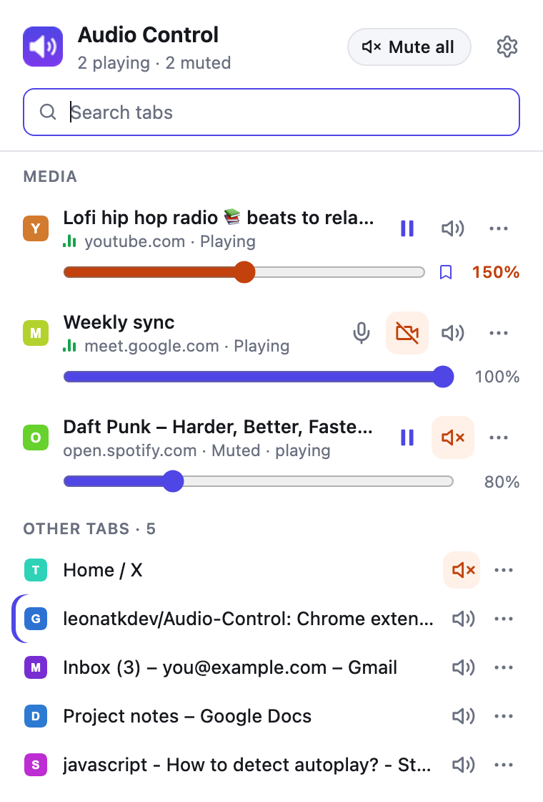
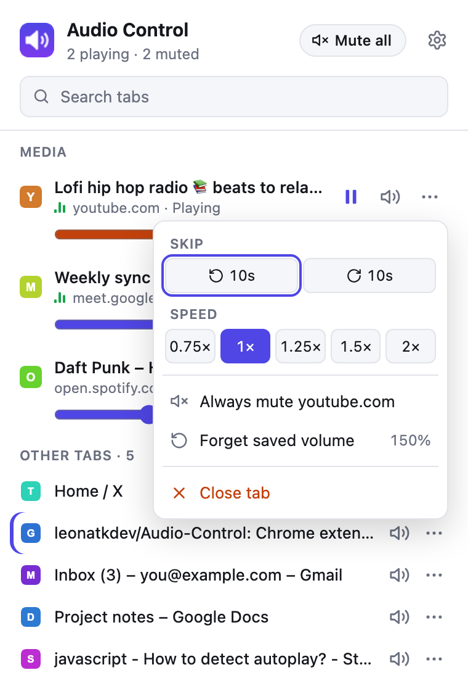
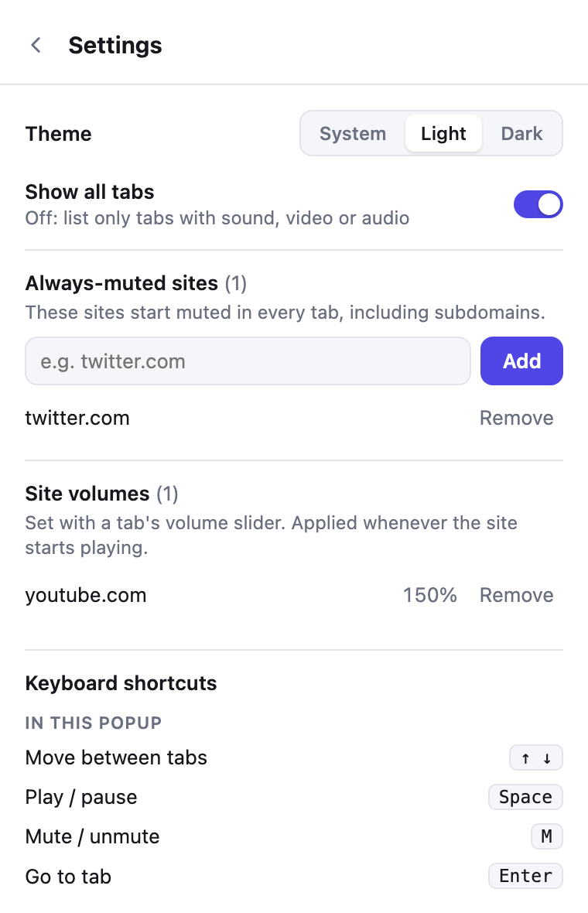

# Audio Control

**Control the sound of every Chrome tab from one place.** Mute a noisy tab, pause YouTube without switching to it, boost a quiet video past 100%, and keep sites like X/Twitter muted for good.

  <picture>
    <source media="(prefers-color-scheme: dark)" srcset="docs/list-dark.png">
    
  </picture>
  &nbsp;&nbsp;
  <picture>
    <source media="(prefers-color-scheme: dark)" srcset="docs/menu-dark.png">
    
  </picture>

Works in Chrome, Edge, Brave, Arc and other Chromium browsers. Free, no account, no tracking.

---

## Contents

- [What it does](#what-it-does)
- [Install](#install)
- [How to use it](#how-to-use-it)
- [Keyboard shortcuts](#keyboard-shortcuts)
- [Privacy and permissions](#privacy-and-permissions)
- [FAQ and troubleshooting](#faq-and-troubleshooting)
- [For developers](#for-developers)
- [License](#license)

## What it does

**Every tab, one list**
- Tabs that are playing sound or have video/audio are listed first, with animated bars on the ones playing now.
- All your other tabs are listed below in a compact list, so you can mute any tab before it makes a sound.
- Search by title or address to find a tab fast.
- The toolbar icon shows how many tabs are making sound.

**Control without switching tabs**
- Play / pause, mute / unmute and a volume slider on each tab.
- In the **⋯** menu: skip back or forward 10 seconds, playback speed (0.75× to 2×) and close the tab.
- **Mute all / Unmute all** in one click.
- **Google Meet:** turn your mic and camera on or off right from the list.

**Volume that goes further**
- **Boost up to 300%** for quiet videos, with a built-in limiter so it gets louder without crackling.
- **Remembered per site:** set YouTube to 150% once and every new YouTube video and tab starts at 150%.

**Automatic muting**
- **Always-muted sites:** pick sites (for example `twitter.com`) that start muted in every tab, now and on future visits.

**Light and dark**
- Follows your system theme, or pick Light or Dark in ⚙ Settings.

## Install

Audio Control isn't in the Chrome Web Store yet, so you install it from this page. It takes about a minute.

1. **Download it.** On this GitHub page, click the green **Code** button, then **Download ZIP**. Unzip it.
   *(Or, with git: `git clone https://github.com/leonatkdev/Audio-Control.git`)*
2. **Open the extensions page.** Type `chrome://extensions` in the address bar and press Enter.
3. **Turn on Developer mode** with the switch in the top-right corner.
4. **Click "Load unpacked"** and choose the unzipped folder (the one that contains `manifest.json`).
5. **Pin it.** Click the puzzle-piece icon in the toolbar and pin **Audio Control**.

> Keep the folder where it is: Chrome loads the extension from it, so deleting or moving the folder removes the extension.

**Updating:** download the new version into the same folder (or run `git pull`), then click the ↻ reload icon on the Audio Control card in `chrome://extensions`. Reload tabs that were already open so the per-site volume works in them.

## How to use it

Click the Audio Control icon in the toolbar.

| To… | Do this |
| --- | --- |
| Go to a tab | Click its title |
| Pause / play | Click ⏸ / ▶ on the tab |
| Mute / unmute a tab | Click the speaker icon (orange = muted) |
| Change volume | Drag the slider. Past 100% it turns orange (boosted) |
| Keep that volume for the site | Nothing to do: it's saved when you let go of the slider (🔖 icon). Drag back to 100% to forget it |
| Skip, change speed, close the tab | Click **⋯** on the tab |
| Always mute a site | **⋯** → **Always mute *site***, or add it in Settings |
| Silence everything | **Mute all** at the top (it becomes **Unmute all**) |
| Switch light / dark theme | ⚙ Settings → **Theme** |
| Manage muted sites, saved volumes, shortcuts | ⚙ Settings (top right) |

  <picture>
    <source media="(prefers-color-scheme: dark)" srcset="docs/settings-dark.png">
    
  </picture>

## Keyboard shortcuts

**Anywhere in Chrome** (on Mac, Alt is ⌥ Option):

| Shortcut | Action |
| --- | --- |
| `Alt+Shift+M` | Mute / unmute the current tab |
| `Alt+Shift+P` | Play / pause the last tab that played sound |
| `Alt+Shift+O` | Mute every tab except the current one |
| `Alt+Shift+A` | Mute / unmute all tabs with sound |

To change them, go to `chrome://extensions/shortcuts` (or ⚙ Settings → **Change shortcuts**). If another extension already uses a key, Chrome leaves it unset; pick your own there.

**Inside the popup:** type to search, `↓` / `↑` to move between tabs, `Space` to play/pause, `M` to mute, `Enter` to go to the tab, `Esc` to clear the search.

## Privacy and permissions

Audio Control **doesn't collect, send or sell anything**. It makes no network requests. Your settings (muted sites, saved volumes) are stored by Chrome and synced across your devices by your own Chrome sync, if you have it turned on.

Chrome will say the extension can "read and change all your data on all websites". Here's why it needs each permission:

| Permission | Why |
| --- | --- |
| Access to all sites | To find the video/audio players on a page so it can pause them, change their volume, speed and position. It doesn't read the page's content. |
| Tabs | To list your tabs with their titles, see which ones play sound, and mute them. |
| Storage | To remember your muted sites and saved volumes. |
| Favicon | To show each site's icon in the list. |

## FAQ and troubleshooting

**The volume slider stops at 100% on some sites.**
Boosting only works where Chrome allows it. It isn't available for video calls (Meet, etc.), for media loaded from another site that doesn't permit it, or on a page you haven't clicked on yet. Click anywhere on the page once and open the popup again.

**The saved volume didn't apply.**
It's applied when new media starts on that site. Reload tabs that were open before you installed or updated the extension. If the site's own volume control changes the level afterwards, the site's choice stays until the next video.

**A tab doesn't show a play button or volume slider.**
The extension can only reach standard video/audio players. Some sounds (games, notification pings, some web apps) don't use one: those can still be muted, just not paused. Chrome also blocks extensions from its own pages (`chrome://…`) and the Chrome Web Store.

**Google Meet mic/camera buttons are missing.**
They appear once you're in a call. They rely on Meet's own buttons, so a Meet redesign could break them. Muting the tab always works.

**Pausing Google Meet isn't offered.**
On purpose: pausing a call's audio would silently cut you off from the call. Use mute instead.

## For developers

No build step: plain JavaScript, Chrome Manifest V3. Load the folder unpacked (see [Install](#install)) and click ↻ on the extension card after each change.

| File | Role |
| --- | --- |
| `manifest.json` | Permissions, popup, content script, shortcuts |
| `background.js` | Service worker: toolbar badge, always-muted sites, remembered volumes, keyboard shortcuts |
| `content/site-volume.js` | Small page script that reports when new media starts, so the site's saved volume can be applied |
| `lib/media.js` | Shared helpers, including the function injected into pages to find and control `<video>`/`<audio>` elements (in all frames and open shadow roots) and the Web Audio boost with limiter |
| `popup/` | The popup UI |
| `docs/` | Screenshots for this README (light and dark) |

- **Mute** uses Chrome's own tab muting, so it silences everything a tab plays, including sounds that aren't on the page.
- **Play/pause, volume, seek and speed** run a small script in the page through `chrome.scripting`.
- **Boost** routes the player through a Web Audio gain node and a limiter, only while above 100%.

## License

[MIT](LICENSE): free to use, change and share, including in your own projects.
